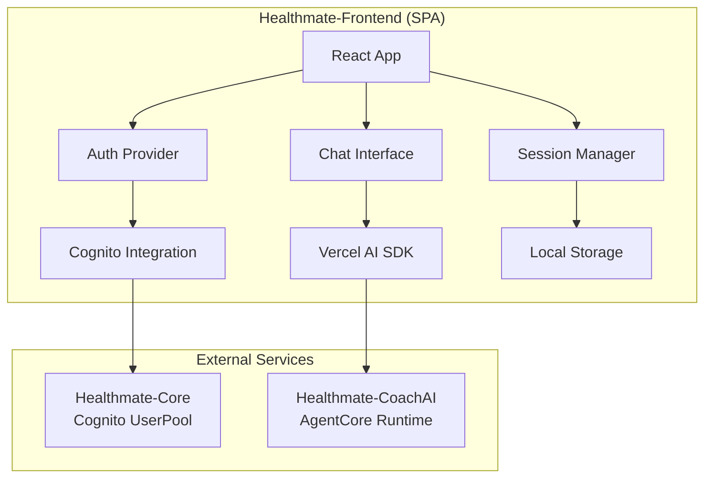

# 設計書

## 概要

Healthmate-Frontendは、React + Vite + TypeScript技術スタックを使用したモダンなSPAフロントエンドです。Vercel AI SDKを活用してCoachAIとのストリーミングチャット機能を実現し、shadcn/uiとTailwind CSSで美しく使いやすいUIを提供します。

## アーキテクチャ

### 全体アーキテクチャ



### 技術スタック詳細

- **フレームワーク**: React 18 + Vite 5
- **言語**: TypeScript 5
- **UIライブラリ**: Tailwind CSS + shadcn/ui
- **AI連携**: Vercel AI SDK (Core & UI)
- **認証**: AWS Cognito SDK
- **状態管理**: React Context + useReducer
- **ルーティング**: React Router v6
- **HTTP クライアント**: fetch API (Vercel AI SDK内蔵)

## コンポーネント設計

### 認証システム

#### AuthProvider コンポーネント（認証セッション管理）
```typescript
interface AuthContextType {
  authSession: AuthSession | null;
  isAuthenticated: boolean;
  login: (username: string, password: string) => Promise<void>;
  logout: () => Promise<void>;
  getJwtToken: () => Promise<string | null>;
  refreshToken: () => Promise<void>;
}

const AuthProvider: React.FC<{ children: ReactNode }> = ({ children }) => {
  const [authSession, setAuthSession] = useState<AuthSession | null>(null);
  
  useEffect(() => {
    // ページ読み込み時に認証セッションを復元
    const savedAuthSession = AuthSessionManager.loadAuthSession();
    if (savedAuthSession) {
      if (AuthSessionManager.isRefreshTokenValid(savedAuthSession)) {
        // Refresh_Tokenが有効な場合
        if (AuthSessionManager.shouldRefreshJwtToken(savedAuthSession)) {
          // JWT_Tokenの更新が必要
          refreshJwtToken(savedAuthSession);
        } else {
          // JWT_Tokenがまだ有効
          setAuthSession(savedAuthSession);
        }
      } else {
        // Refresh_Tokenが期限切れ → Auth_Session期限切れ
        AuthSessionManager.clearAuthSession();
        // ログイン画面にリダイレクト
      }
    }
  }, []);
  
  const refreshJwtToken = async (currentSession: AuthSession) => {
    try {
      // Cognito APIを使用してJWT_Tokenを更新
      const newJwtToken = await cognitoClient.refreshToken(currentSession.refreshToken);
      const updatedSession = {
        ...currentSession,
        jwtToken: newJwtToken,
        tokenExpiry: new Date(Date.now() + 60 * 60 * 1000) // 1時間後
      };
      AuthSessionManager.saveAuthSession(updatedSession);
      setAuthSession(updatedSession);
    } catch (error) {
      // Refresh失敗 → Auth_Session期限切れ
      AuthSessionManager.clearAuthSession();
      // ログイン画面にリダイレクト
    }
  };
  
  // Cognito認証ロジック
  // JWT トークン管理
  // 自動リフレッシュ機能
};
```

#### ProtectedRoute コンポーネント
```typescript
const ProtectedRoute: React.FC<{ children: ReactNode }> = ({ children }) => {
  const { isAuthenticated } = useAuth();
  
  if (!isAuthenticated) {
    return <Navigate to="/login" replace />;
  }
  
  return <>{children}</>;
};
```

### チャットシステム

#### ChatProvider コンポーネント（チャットセッション管理）
```typescript
interface ChatContextType {
  chatSessions: ChatSession[];
  currentChatSession: ChatSession | null;
  createNewChatSession: () => void;
  switchChatSession: (chatSessionId: string) => void;
  deleteChatSession: (chatSessionId: string) => void;
  updateChatSessionTitle: (chatSessionId: string, title: string) => void;
}

const ChatProvider: React.FC<{ children: ReactNode }> = ({ children }) => {
  const [chatSessions, setChatSessions] = useState<ChatSession[]>([]);
  const [currentChatSession, setCurrentChatSession] = useState<ChatSession | null>(null);
  
  useEffect(() => {
    // ページ読み込み時にチャットセッションを復元
    const savedChatSessions = ChatSessionManager.loadChatSessions();
    setChatSessions(savedChatSessions);
    
    // アクティブなセッションを探す
    const activeSession = savedChatSessions.find(session => session.isActive);
    if (activeSession) {
      setCurrentChatSession(activeSession);
    } else if (savedChatSessions.length === 0) {
      // 初回訪問時は新しいセッションを作成
      const newSession = ChatSessionManager.createNewChatSession();
      setChatSessions([newSession]);
      setCurrentChatSession(newSession);
    }
  }, []);
  
  // チャットセッション管理ロジック
  // ローカルストレージとの同期
};
```

#### ChatInterface コンポーネント
```typescript
const ChatInterface: React.FC = () => {
  const { getJwtToken } = useAuth();
  const { currentChatSession } = useChat();
  
  const { messages, input, handleInputChange, handleSubmit, isLoading } = useChat({
    api: '/api/chat',
    headers: async () => ({
      'Authorization': `Bearer ${await getJwtToken()}`,
      'Content-Type': 'application/json',
    }),
    body: {
      sessionId: currentChatSession?.id, // チャットセッションID
      timezone: 'Asia/Tokyo',
      language: 'ja'
    }
  });
  
  return (
    <div className="flex flex-col h-full">
      <MessageList messages={messages} />
      <MessageInput 
        input={input}
        onChange={handleInputChange}
        onSubmit={handleSubmit}
        isLoading={isLoading}
      />
    </div>
  );
};
```

#### MessageList コンポーネント
```typescript
const MessageList: React.FC<{ messages: Message[] }> = ({ messages }) => {
  return (
    <div className="flex-1 overflow-y-auto p-4 space-y-4">
      {messages.map((message) => (
        <MessageBubble key={message.id} message={message} />
      ))}
    </div>
  );
};
```

#### MessageBubble コンポーネント
```typescript
const MessageBubble: React.FC<{ message: Message }> = ({ message }) => {
  const isUser = message.role === 'user';
  
  return (
    <div className={`flex ${isUser ? 'justify-end' : 'justify-start'}`}>
      <div className={`max-w-xs lg:max-w-md px-4 py-2 rounded-lg ${
        isUser 
          ? 'bg-blue-500 text-white'  // ユーザーメッセージ: 青色、右寄せ
          : 'bg-gray-200 text-gray-800' // AIメッセージ: グレー、左寄せ
      }`}>
        {isUser ? (
          <p>{message.content}</p> // ユーザーメッセージ: プレーンテキスト
        ) : (
          <ReactMarkdown>{message.content}</ReactMarkdown> // AIメッセージ: Markdown レンダリング
        )}
      </div>
    </div>
  );
};
```

### セッション管理システム

#### AuthSessionManager クラス（認証セッション管理）
```typescript
class AuthSessionManager {
  private static readonly AUTH_STORAGE_KEY = 'healthmate-auth-session';
  
  static saveAuthSession(authSession: AuthSession): void {
    sessionStorage.setItem(this.AUTH_STORAGE_KEY, JSON.stringify(authSession));
  }
  
  static loadAuthSession(): AuthSession | null {
    const stored = sessionStorage.getItem(this.AUTH_STORAGE_KEY);
    return stored ? JSON.parse(stored) : null;
  }
  
  static clearAuthSession(): void {
    sessionStorage.removeItem(this.AUTH_STORAGE_KEY);
  }
  
  static isJwtTokenValid(authSession: AuthSession): boolean {
    // JWT_Tokenの有効期限チェック（通常1時間）
    return new Date() < new Date(authSession.tokenExpiry);
  }
  
  static isRefreshTokenValid(authSession: AuthSession): boolean {
    // Refresh_Tokenの有効期限チェック（通常30日）
    return new Date() < new Date(authSession.refreshTokenExpiry);
  }
  
  static shouldRefreshJwtToken(authSession: AuthSession): boolean {
    // JWT_Tokenの有効期限が5分以内の場合、更新が必要
    const fiveMinutesFromNow = new Date(Date.now() + 5 * 60 * 1000);
    return new Date(authSession.tokenExpiry) < fiveMinutesFromNow;
  }
}
```
```

#### ChatSessionManager クラス（チャットセッション管理）
```typescript
class ChatSessionManager {
  private static readonly CHAT_STORAGE_KEY = 'healthmate-chat-sessions';
  
  static saveChatSessions(chatSessions: ChatSession[]): void {
    localStorage.setItem(this.CHAT_STORAGE_KEY, JSON.stringify(chatSessions));
  }
  
  static loadChatSessions(): ChatSession[] {
    const stored = localStorage.getItem(this.CHAT_STORAGE_KEY);
    return stored ? JSON.parse(stored) : [];
  }
  
  static generateChatSessionId(): string {
    // CoachAI要件: 33文字以上のセッションID
    return `healthmate-chat-${Date.now()}-${Math.random().toString(36).substr(2, 15)}`;
  }
  
  static createNewChatSession(): ChatSession {
    return {
      id: this.generateChatSessionId(),
      title: '新しいチャット',
      createdAt: new Date(),
      updatedAt: new Date(),
      messages: [], // 空のChat_History（メッセージやり取り履歴）で開始
      isActive: true
    };
  }
}
```

## データモデル

### AuthSession インターフェース（認証セッション）
```typescript
interface AuthSession {
  userId: string;
  username: string;
  email: string;
  jwtToken: string;        // 短期間有効（通常1時間）
  refreshToken: string;    // 長期間有効（通常30日）
  tokenExpiry: Date;       // JWT_Tokenの有効期限
  refreshTokenExpiry: Date; // Refresh_Tokenの有効期限
  isActive: boolean;
}
```

### ChatSession インターフェース（チャットセッション）
```typescript
interface ChatSession {
  id: string; // 33文字以上（CoachAI要件）
  title: string;
  createdAt: Date;
  updatedAt: Date;
  messages: Message[]; // このセッション内のChat_History（メッセージやり取り履歴）
  isActive: boolean;
}
```

### Message インターフェース
```typescript
interface Message {
  id: string;
  role: 'user' | 'assistant'; // 'user': ユーザーが投げたメッセージ, 'assistant': AIから受け取ったメッセージ
  content: string;
  timestamp: Date;
  chatSessionId: string; // どのChatSessionに属するかを示す
}
```

#### Messageの種類
1. **ユーザーメッセージ** (`role: 'user'`)
   - ユーザーがCoachAIに送信したメッセージ
   - チャット画面では右側（送信者側）に表示
   - プレーンテキストとして表示

2. **AIメッセージ** (`role: 'assistant'`)
   - CoachAIからユーザーに送信されたメッセージ
   - チャット画面では左側（受信者側）に表示
   - Markdown形式でレンダリングして表示
   - ストリーミング応答で段階的に表示される

### CognitoUser インターフェース（廃止 - AuthSessionに統合）
```typescript
// このインターフェースはAuthSessionに統合されました
```

## API統合

### CoachAI API エンドポイント
```typescript
// Vercel AI SDK用のAPI設定
const chatConfig = {
  api: '/api/chat',
  headers: async () => {
    const token = await getJwtToken();
    return {
      'Authorization': `Bearer ${token}`,
      'Content-Type': 'application/json',
    };
  },
  body: {
    sessionId: currentSession?.id,
    timezone: 'Asia/Tokyo',
    language: 'ja'
  }
};
```

### API プロキシ設定
```typescript
// vite.config.ts でのプロキシ設定
export default defineConfig({
  server: {
    proxy: {
      '/api/chat': {
        target: process.env.VITE_COACHAI_ENDPOINT,
        changeOrigin: true,
        rewrite: (path) => path.replace(/^\/api\/chat/, ''),
      }
    }
  }
});
```

## 正確性プロパティ

*プロパティとは、システムのすべての有効な実行において真であるべき特性や動作のことです。これらは人間が読める仕様と機械で検証可能な正確性保証の橋渡しとなります。*

### プロパティ1: 認証状態の一貫性
*すべての*認証済みユーザーに対して、JWT トークンが有効である限り、アプリケーションの全機能にアクセスできる
**検証対象: 要件 1.2, 1.3**

### プロパティ2: チャットセッション継続性
*すべての*チャットセッションに対して、ユーザーが明示的に新しいセッションを作成しない限り、Chat_History（メッセージやり取り履歴）が保持される
**検証対象: 要件 3.1, 3.2, 3.3**

### プロパティ3: 認証セッション管理
*すべての*認証セッションに対して、JWT トークンが有効である限り、ユーザーの認証状態が維持される
**検証対象: 要件 9.1, 9.2, 9.3**

### プロパティ4: ストリーミング応答の完全性
*すべての*CoachAIからの応答に対して、ストリーミング中に接続が切断されない限り、完全なメッセージが表示される
**検証対象: 要件 2.1, 2.2**

### プロパティ5: Markdown レンダリングの安全性
*すべての*AIからのMarkdown応答に対して、XSS攻撃を防ぐために適切にサニタイズされてレンダリングされる
**検証対象: 要件 2.3**

### プロパティ6: レスポンシブレイアウトの一貫性
*すべての*画面サイズに対して、UIコンポーネントが適切に表示され、機能が利用可能である
**検証対象: 要件 5.1, 5.2**

### プロパティ7: エラー回復の堅牢性
*すべての*ネットワークエラーまたはサーバーエラーに対して、アプリケーションは適切なエラーメッセージを表示し、基本機能を維持する
**検証対象: 要件 8.1, 8.2, 8.4**

### プロパティ8: チャットセッション作成の一意性
*すべての*新しいチャットセッションに対して、一意のセッションIDが生成され、既存のセッションと重複しない
**検証対象: 要件 4.2, 4.3**

### プロパティ9: アクセシビリティの準拠性
*すべての*UIコンポーネントに対して、WCAG 2.1 AA基準に準拠したアクセシビリティ機能が実装されている
**検証対象: 要件 7.1, 7.2, 7.3**

## エラーハンドリング

### エラー分類と対応

#### 認証エラー
```typescript
class AuthErrorHandler {
  static handle(error: AuthError): void {
    switch (error.type) {
      case 'TOKEN_EXPIRED':
        // 自動リフレッシュ試行
        break;
      case 'INVALID_CREDENTIALS':
        // ログイン画面にリダイレクト
        break;
      case 'NETWORK_ERROR':
        // リトライ機能付きエラー表示
        break;
    }
  }
}
```

#### チャットエラー
```typescript
class ChatErrorHandler {
  static handle(error: ChatError): void {
    switch (error.type) {
      case 'STREAMING_INTERRUPTED':
        // 部分的なメッセージを保存し、再送信オプションを提供
        break;
      case 'COACHAI_UNAVAILABLE':
        // サービス停止メッセージを表示
        break;
      case 'RATE_LIMIT_EXCEEDED':
        // 待機時間を表示
        break;
    }
  }
}
```

### エラー境界コンポーネント
```typescript
class ErrorBoundary extends React.Component<Props, State> {
  constructor(props: Props) {
    super(props);
    this.state = { hasError: false, error: null };
  }

  static getDerivedStateFromError(error: Error): State {
    return { hasError: true, error };
  }

  componentDidCatch(error: Error, errorInfo: ErrorInfo) {
    console.error('Error caught by boundary:', error, errorInfo);
    // エラー報告サービスに送信
  }

  render() {
    if (this.state.hasError) {
      return <ErrorFallback error={this.state.error} />;
    }

    return this.props.children;
  }
}
```

## テスト戦略

### 二重テストアプローチ

**単体テスト**: 特定の例、エッジケース、エラー条件を検証
**プロパティテスト**: すべての入力にわたる汎用プロパティを検証
両方のテストは補完的であり、包括的なカバレッジに必要です

### 単体テスト戦略
- **コンポーネントテスト**: React Testing Libraryを使用
- **フック テスト**: @testing-library/react-hooksを使用
- **統合テスト**: MSW（Mock Service Worker）でAPI モック
- **E2Eテスト**: Playwrightでユーザーフロー全体をテスト

### プロパティベーステスト設定
- **ライブラリ**: fast-check（JavaScript/TypeScript用）
- **最小反復回数**: 各プロパティテストで100回
- **タグ形式**: **Feature: healthmate-frontend, Property {number}: {property_text}**

### テスト例
```typescript
// 単体テスト例
describe('ChatInterface', () => {
  it('should display messages correctly', () => {
    const messages = [
      { id: '1', role: 'user', content: 'Hello', timestamp: new Date(), sessionId: 'session1' }
    ];
    render(<ChatInterface messages={messages} />);
    expect(screen.getByText('Hello')).toBeInTheDocument();
  });
});

// プロパティテスト例
describe('ChatSessionManager', () => {
  it('should generate unique chat session IDs', () => {
    fc.assert(fc.property(fc.integer(1, 1000), (count) => {
      const ids = Array.from({ length: count }, () => ChatSessionManager.generateChatSessionId());
      const uniqueIds = new Set(ids);
      return uniqueIds.size === ids.length;
    }));
  });
});
```

## パフォーマンス最適化

### コード分割
```typescript
// 遅延読み込みによるコード分割
const ChatInterface = lazy(() => import('./components/ChatInterface'));
const Settings = lazy(() => import('./components/Settings'));

function App() {
  return (
    <Suspense fallback={<LoadingSpinner />}>
      <Routes>
        <Route path="/chat" element={<ChatInterface />} />
        <Route path="/settings" element={<Settings />} />
      </Routes>
    </Suspense>
  );
}
```

### メモ化戦略
```typescript
// React.memo でコンポーネントの再レンダリングを最適化
const MessageBubble = React.memo<MessageBubbleProps>(({ message }) => {
  return (
    <div className="message-bubble">
      <ReactMarkdown>{message.content}</ReactMarkdown>
    </div>
  );
});

// useMemo でコストの高い計算をキャッシュ
const ChatInterface: React.FC = () => {
  const sortedMessages = useMemo(() => 
    messages.sort((a, b) => a.timestamp.getTime() - b.timestamp.getTime()),
    [messages]
  );
  
  return <MessageList messages={sortedMessages} />;
};
```

### バンドル最適化
```typescript
// vite.config.ts
export default defineConfig({
  build: {
    rollupOptions: {
      output: {
        manualChunks: {
          vendor: ['react', 'react-dom'],
          ui: ['@radix-ui/react-dialog', '@radix-ui/react-button'],
          ai: ['ai', '@ai-sdk/react']
        }
      }
    }
  }
});
```