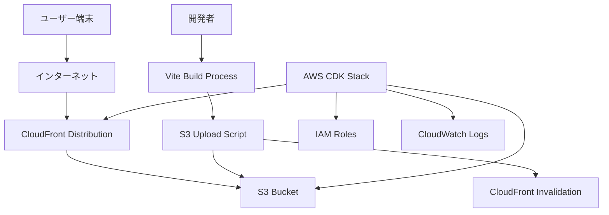
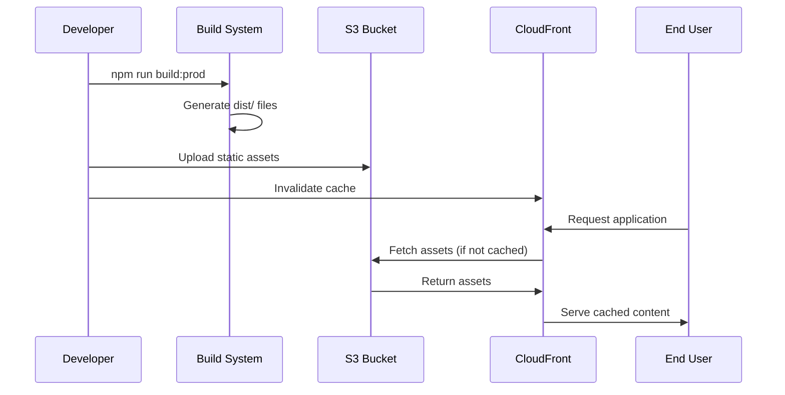

# Design Document: S3 + CloudFront Hosting

## Overview

Healthmate-Frontend を Amazon S3 + CloudFront を使用してインターネット経由でアクセス可能にする静的ホスティングソリューション。既存の Vite ビルドシステムと環境別設定を活用し、AWS CDK を使用してインフラストラクチャを管理する。

## Architecture

### High-Level Architecture



### Component Interaction



## Components and Interfaces

### 1. CDK Infrastructure Stack

**Purpose**: AWS リソースの作成と管理

**Location**: `cdk/` ディレクトリ（新規作成）

**Key Components**:
- S3 Bucket with static website hosting configuration
- CloudFront Distribution with appropriate caching policies
- IAM roles for deployment and access
- CloudWatch monitoring and logging

**Interface**:
```python
from dataclasses import dataclass
from typing import Optional, Literal
from aws_cdk import Stack, StackProps

@dataclass
class HostingStackProps:
    environment: Literal['dev', 'stage', 'prod']
    domain_name: Optional[str] = None  # 将来の独自ドメイン対応用

class HealthmateFrontendHostingStack(Stack):
    def __init__(self, scope, construct_id: str, props: HostingStackProps, **kwargs):
        super().__init__(scope, construct_id, **kwargs)
        self.distribution_domain_name: str = ""
        self.bucket_name: str = ""
```

### 2. Build and Deployment System

**Purpose**: Vite ビルドから S3 アップロードまでの自動化

**Location**: `scripts/` ディレクトリ（新規作成）

**Key Components**:
- Build script wrapper
- S3 upload utility
- CloudFront invalidation utility
- Environment-specific configuration loader

**Interface**:
```python
from dataclasses import dataclass
from typing import List, Optional, Literal

@dataclass
class DeploymentConfig:
    environment: Literal['dev', 'stage', 'prod']
    bucket_name: str
    distribution_id: str
    region: str

@dataclass
class DeploymentResult:
    success: bool
    distribution_url: str
    uploaded_files: int
    invalidation_id: Optional[str] = None
    errors: Optional[List[str]] = None
```

### 3. Environment Configuration Extension

**Purpose**: S3/CloudFront 用の環境変数管理

**Location**: 既存の `src/config/environment.ts` を拡張（フロントエンド側）+ Python CDK での環境変数読み込み

**New Environment Variables**:
```typescript
// フロントエンド側（TypeScript）
interface ImportMetaEnv {
  // 既存の変数...
  readonly VITE_S3_BUCKET_NAME: string;
  readonly VITE_CLOUDFRONT_DISTRIBUTION_ID: string;
  readonly VITE_CLOUDFRONT_DOMAIN: string;
}
```

**CDK Environment Configuration**:
```python
# CDK側（Python）
import os
from typing import Dict, Any

def get_environment_config(environment: str) -> Dict[str, Any]:
    """環境別設定を取得"""
    return {
        'region': os.environ.get('AWS_REGION', 'us-west-2'),
        'environment': environment,
        'bucket_prefix': f'healthmate-frontend-{environment}',
        'tags': {
            'Environment': environment,
            'Service': 'healthmate-frontend',
            'CostCenter': 'healthmate'
        }
    }
```

### 4. Security Configuration

**Purpose**: セキュリティヘッダーとアクセス制御

**Components**:
- CloudFront Response Headers Policy
- S3 Bucket Policy for CloudFront-only access
- HTTPS redirect configuration

## Data Models

### CDK Stack Configuration

```python
from dataclasses import dataclass
from typing import List, Literal, Optional
from aws_cdk.aws_s3 import CorsRule
from aws_cdk.aws_cloudfront import CacheBehavior, ErrorResponse

@dataclass
class S3BucketConfig:
    bucket_name: str
    versioning: bool
    encryption: Literal['AES256', 'aws:kms']
    public_read_access: bool
    website_index_document: str
    website_error_document: str
    cors_configuration: List[CorsRule]

@dataclass
class CloudFrontConfig:
    origin_access_identity: str
    price_class: Literal['PriceClass_All', 'PriceClass_100', 'PriceClass_200']
    cache_behaviors: List[CacheBehavior]
    error_pages: List[ErrorResponse]
    security_headers_policy_id: str
    logging_bucket: Optional[str] = None
```

### Deployment Metadata

```python
from dataclasses import dataclass
from typing import List
from datetime import datetime

@dataclass
class FileMetadata:
    key: str
    size: int
    content_type: str
    etag: str

@dataclass
class DeploymentMetadata:
    timestamp: datetime
    environment: str
    build_hash: str
    deployed_files: List[FileMetadata]
    distribution_url: str
    invalidation_id: str
```

## Correctness Properties

*A property is a characteristic or behavior that should hold true across all valid executions of a system-essentially, a formal statement about what the system should do. Properties serve as the bridge between human-readable specifications and machine-verifiable correctness guarantees.*

Based on the prework analysis, the following properties have been identified as testable through property-based testing:

### Infrastructure Properties

**Property 1: S3 Bucket Configuration Consistency**
*For any* deployed CDK stack, the S3 bucket should have static website hosting enabled with index.html as the default document and appropriate CORS configuration
**Validates: Requirements 1.1, 1.2, 1.3**

**Property 2: S3 Bucket Naming Convention**
*For any* environment deployment, the S3 bucket name should follow the pattern "healthmate-frontend-{environment}-{random-suffix}"
**Validates: Requirements 1.4**

**Property 3: S3 Bucket Security Configuration**
*For any* S3 bucket created by the stack, versioning should be enabled and server-side encryption should be configured
**Validates: Requirements 1.5, 5.3**

**Property 4: CloudFront Distribution Configuration**
*For any* CloudFront distribution created by the stack, it should point to the S3 bucket as origin and have compression enabled
**Validates: Requirements 2.1, 2.4**

**Property 5: SPA Routing Support**
*For any* request to a non-existent path on the CloudFront distribution, it should return index.html with a 200 status code
**Validates: Requirements 2.3**

### Deployment Properties

**Property 6: Build Output Generation**
*For any* deployment script execution, running "npm run build" should generate files in the dist/ directory
**Validates: Requirements 3.1**

**Property 7: File Upload Completeness**
*For any* build output, all files in the dist/ directory should be uploaded to S3 with correct MIME types
**Validates: Requirements 3.2, 3.4**

**Property 8: Cache Invalidation**
*For any* successful file upload to S3, a CloudFront invalidation should be triggered
**Validates: Requirements 3.3**

**Property 9: Environment Variable Integration**
*For any* build process, the generated files should contain the correct environment-specific configuration values
**Validates: Requirements 4.1**

**Property 10: Build Optimization**
*For any* production build, the generated assets should be minified and optimized for size
**Validates: Requirements 4.2**

### Security Properties

**Property 11: HTTPS Enforcement**
*For any* HTTP request to the CloudFront distribution, it should redirect to HTTPS
**Validates: Requirements 5.4**

**Property 12: Security Headers**
*For any* response from CloudFront, it should include appropriate security headers (HSTS, X-Content-Type-Options, etc.)
**Validates: Requirements 5.2**

**Property 13: S3 Access Control**
*For any* direct S3 bucket access attempt, non-website endpoints should be blocked while allowing CloudFront access
**Validates: Requirements 5.1**

### Monitoring Properties

**Property 14: Logging Configuration**
*For any* deployed CloudFront distribution, access logging should be enabled and CloudWatch alarms should be configured
**Validates: Requirements 6.1, 6.3**

**Property 15: Cost Optimization**
*For any* deployed resources, they should have appropriate cost allocation tags and use cost-effective configurations
**Validates: Requirements 7.2, 7.5**

### Cleanup Properties

**Property 16: Resource Cleanup**
*For any* CDK stack destruction, all resources including S3 bucket contents should be properly cleaned up
**Validates: Requirements 8.1, 8.2**

## Error Handling

### Build Process Errors

**Environment Variable Validation**:
- Missing required environment variables should cause build failure with clear error messages
- Invalid environment variable values should be detected and reported

**Build Failure Recovery**:
- Failed builds should not leave partial artifacts in dist/ directory
- Build errors should be logged with sufficient detail for debugging

### Deployment Errors

**S3 Upload Failures**:
- Network failures during upload should trigger retry logic
- Partial uploads should be detected and resumed
- Upload failures should not leave the application in an inconsistent state

**CloudFront Invalidation Failures**:
- Failed invalidations should be retried with exponential backoff
- Deployment should succeed even if invalidation fails (with warning)

**CDK Deployment Failures**:
- Stack creation failures should leave no orphaned resources
- Update failures should maintain previous working state
- Clear error messages should guide troubleshooting

### Runtime Errors

**CloudFront Error Pages**:
- 404 errors should serve index.html for SPA routing
- 5xx errors should display user-friendly error pages
- Error pages should not expose sensitive system information

**S3 Access Errors**:
- Bucket access errors should be handled gracefully by CloudFront
- Temporary S3 outages should be mitigated by CloudFront caching

## Testing Strategy

### Dual Testing Approach

The testing strategy combines unit tests for specific scenarios and property-based tests for comprehensive coverage:

**Unit Tests**:
- CDK stack synthesis and deployment validation
- Deployment script functionality with mocked AWS services
- Environment configuration loading and validation
- Error handling scenarios with specific inputs

**Property-Based Tests**:
- Infrastructure configuration validation across multiple environments
- File upload and deployment workflows with generated test data
- Security configuration verification with various request patterns
- Performance and optimization validation with different asset types

### Property-Based Testing Configuration

**Testing Framework**: pytest with hypothesis for property-based testing
**Test Configuration**: Minimum 100 iterations per property test
**Test Tagging**: Each property test references its design document property

Example test structure:
```python
# Feature: s3-cloudfront-hosting, Property 1: S3 Bucket Configuration Consistency
import pytest
from hypothesis import given, strategies as st

@given(environment=st.sampled_from(['dev', 'stage', 'prod']))
def test_s3_bucket_configuration_consistency(environment):
    """Property 1: S3 Bucket Configuration Consistency
    
    For any deployed CDK stack, the S3 bucket should have static website 
    hosting enabled with index.html as the default document and appropriate 
    CORS configuration.
    
    Validates: Requirements 1.1, 1.2, 1.3
    """
    stack = deploy_stack(environment)
    bucket = get_bucket_configuration(stack.bucket_name)
    
    assert bucket.website_configuration.index_document == 'index.html'
    assert bucket.cors_configuration is not None
    assert bucket.public_read_access is True

@given(
    environment=st.sampled_from(['dev', 'stage', 'prod']),
    random_suffix=st.text(alphabet=st.characters(whitelist_categories=('Ll', 'Nd')), min_size=8, max_size=12)
)
def test_s3_bucket_naming_convention(environment, random_suffix):
    """Property 2: S3 Bucket Naming Convention
    
    For any environment deployment, the S3 bucket name should follow 
    the pattern "healthmate-frontend-{environment}-{random-suffix}".
    
    Validates: Requirements 1.4
    """
    stack = deploy_stack(environment)
    expected_pattern = f"healthmate-frontend-{environment}-"
    
    assert stack.bucket_name.startswith(expected_pattern)
    assert len(stack.bucket_name) > len(expected_pattern)
```

### Integration Testing

**End-to-End Deployment Tests**:
- Full deployment workflow from build to accessible application
- Cross-environment deployment validation
- Performance and security validation on deployed infrastructure

**AWS Service Integration**:
- Real AWS service integration tests in development environment
- CloudFormation stack validation
- S3 and CloudFront service interaction testing

**Python Testing Setup**:
```python
# conftest.py
import pytest
import boto3
from moto import mock_s3, mock_cloudfront
from aws_cdk import App
from cdk.healthmate_frontend_hosting_stack import HealthmateFrontendHostingStack

@pytest.fixture
def aws_credentials():
    """Mocked AWS Credentials for moto."""
    import os
    os.environ['AWS_ACCESS_KEY_ID'] = 'testing'
    os.environ['AWS_SECRET_ACCESS_KEY'] = 'testing'
    os.environ['AWS_SECURITY_TOKEN'] = 'testing'
    os.environ['AWS_SESSION_TOKEN'] = 'testing'

@pytest.fixture
def cdk_app():
    """CDK App fixture for testing."""
    return App()

@pytest.fixture
@mock_s3
@mock_cloudfront
def mock_aws_services(aws_credentials):
    """Mock AWS services for testing."""
    yield {
        's3': boto3.client('s3', region_name='us-west-2'),
        'cloudfront': boto3.client('cloudfront', region_name='us-west-2')
    }
```