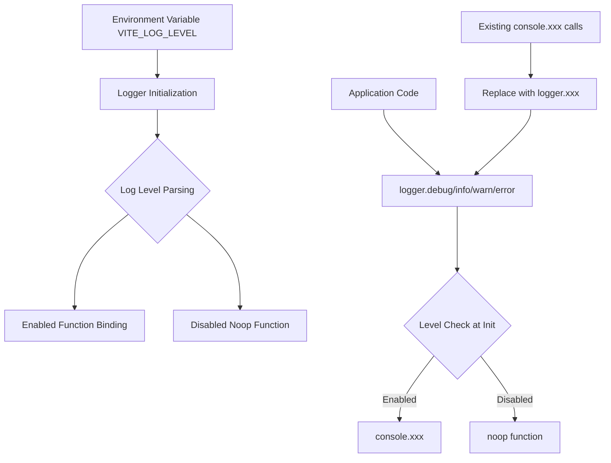
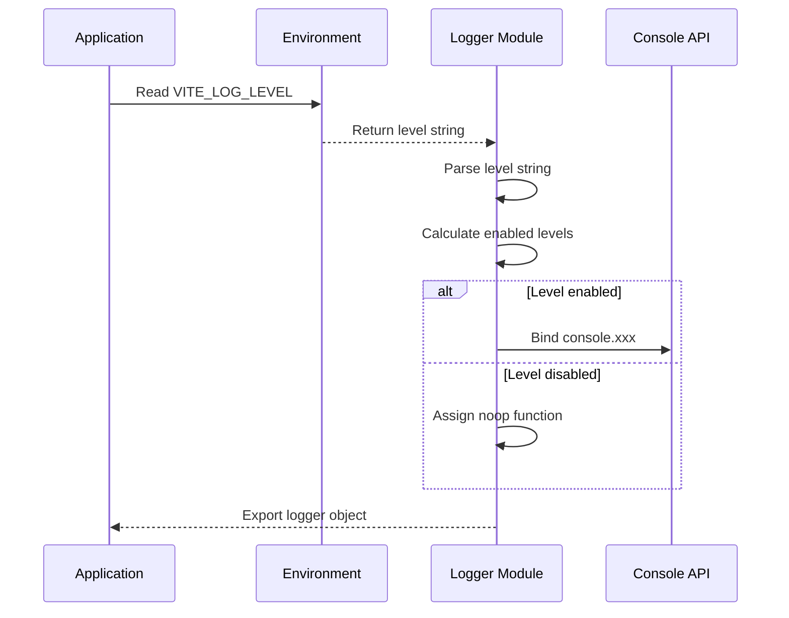
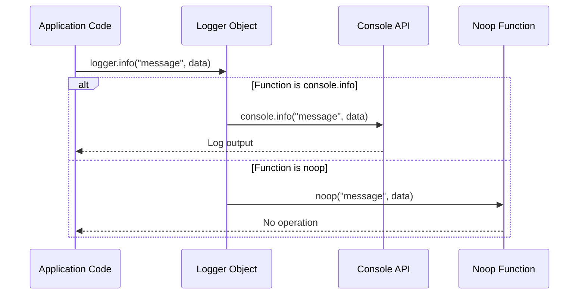

# Design Document

## Overview

Healthmate-Frontend サービス用のシンプルなloggerラッパーを設計します。このloggerは環境変数 `VITE_LOG_LEVEL` に基づいてログ出力を制御し、既存の複雑なlogger実装を置き換えます。設計の核心は**シンプルさ**と**パフォーマンス**であり、不要な機能を排除して最小限の実装を目指します。

## Architecture

### Core Design Principles

1. **Simplicity First**: 複雑な機能（機密情報マスキング、タイムスタンプ、コンポーネント名など）は実装しない
2. **Performance Optimized**: 無効化されたログレベルでは実行時オーバーヘッドを完全に排除
3. **Drop-in Replacement**: 既存の `console.xxx` 呼び出しを最小限の変更で置き換え可能
4. **Zero Dependencies**: 外部ライブラリに依存しない純粋なTypeScript実装

### Architecture Diagram



## Components and Interfaces

### Logger Module Structure

```typescript
// src/lib/logger.ts

type Level = "DEBUG" | "INFO" | "WARN" | "ERROR" | "NONE";
type LogFn = (...args: unknown[]) => void;

interface Logger {
  debug: LogFn;
  info: LogFn;
  warn: LogFn;
  error: LogFn;
}
```

### Core Components

#### 1. Level Type Definition
```typescript
type Level = "DEBUG" | "INFO" | "WARN" | "ERROR" | "NONE";
```
- 5つのログレベルを定義
- "NONE" は全てのログを無効化

#### 2. Log Function Type
```typescript
type LogFn = (...args: unknown[]) => void;
```
- console.xxx と同じシグネチャ
- 可変長引数をサポート

#### 3. Level Order Mapping
```typescript
const order: Record<Level, number> = {
  DEBUG: 10,
  INFO: 20,
  WARN: 30,
  ERROR: 40,
  NONE: 99,
};
```
- 階層的ログレベル制御
- 数値による比較で効率的な判定

#### 4. Enabled Check Function
```typescript
const enabled = (level: Level) => order[level] >= order[LOG_LEVEL];
```
- 初期化時に一度だけ実行
- ランタイムでの条件分岐を排除

#### 5. Logger Object
```typescript
export const logger: Logger = {
  debug: enabled("DEBUG") ? console.debug.bind(console) : noop,
  info: enabled("INFO") ? console.info.bind(console) : noop,
  warn: enabled("WARN") ? console.warn.bind(console) : noop,
  error: enabled("ERROR") ? console.error.bind(console) : noop,
};
```
- 初期化時に関数を決定
- 無効な場合はnoop関数を使用

## Data Models

### Environment Configuration

```typescript
interface EnvironmentConfig {
  VITE_LOG_LEVEL?: string; // 環境変数から取得
}
```

### Logger Configuration

```typescript
interface LoggerConfig {
  currentLevel: Level;        // 現在のログレベル
  enabledLevels: Set<Level>;  // 有効なログレベルのセット
}
```

### Log Level Hierarchy

```
NONE (99)  - すべてのログを無効化
  ↑
ERROR (40) - エラーのみ
  ↑  
WARN (30)  - 警告以上
  ↑
INFO (20)  - 情報以上  
  ↑
DEBUG (10) - すべてのログ（デフォルト）
```

## Implementation Details

### Initialization Flow



### Runtime Execution Flow



### File Replacement Strategy

#### Target Files for Replacement

1. **src/hooks/useEnvironment.ts**
   ```typescript
   // Before
   console.warn('Environment configuration errors:', validation.errors);
   
   // After  
   import { logger } from '@/lib/logger';
   logger.warn('Environment configuration errors:', validation.errors);
   ```

2. **src/api/chat.ts**
   ```typescript
   // Before
   console.error('❌ CoachAI API error:', error);
   console.warn('Failed to parse AgentCore streaming data:', dataJson);
   
   // After
   import { logger } from '@/lib/logger';
   logger.error('❌ CoachAI API error:', error);
   logger.warn('Failed to parse AgentCore streaming data:', dataJson);
   ```

3. **src/config/environment.ts**
   ```typescript
   // Before
   console.warn(`Invalid environment: ${env}, defaulting to ${DEFAULT_ENVIRONMENT}`);
   
   // After
   import { logger } from '@/lib/logger';
   logger.warn(`Invalid environment: ${env}, defaulting to ${DEFAULT_ENVIRONMENT}`);
   ```

### Cleanup Strategy

#### Files to Remove
- `src/lib/hybrid-logger.ts` - loglevelベースの実装（依存関係なし）
- `src/lib/logger-with-loglevel.ts` - 未完成の実装例
- 既存の `src/lib/logger.ts` - 複雑すぎる実装

#### Files to Keep
- 新しい `src/lib/logger.ts` - シンプルなラッパー実装

## Correctness Properties

*A property is a characteristic or behavior that should hold true across all valid executions of a system-essentially, a formal statement about what the system should do. Properties serve as the bridge between human-readable specifications and machine-verifiable correctness guarantees.*

### Property 1: Logger Interface Compatibility
*For any* logger method (debug, info, warn, error), it should accept the same variable arguments as the corresponding console method and maintain the same function signature
**Validates: Requirements 1.1, 3.2, 3.3, 5.5**

### Property 2: Hierarchical Log Level Control  
*For any* log level setting, only log methods at that level or higher priority should produce output, with NONE suppressing all output
**Validates: Requirements 1.2, 1.3, 2.4**

### Property 3: Performance Optimization for Disabled Logs
*For any* disabled log level, the corresponding logger method should be a noop function that performs no operations or string processing
**Validates: Requirements 1.5, 4.1, 4.4**

### Property 4: Initialization-Time Configuration
*For any* logger instance, the enabled/disabled status and console method binding should be determined at module initialization time, not at runtime
**Validates: Requirements 2.1, 4.2, 4.3**

### Property 5: Console Method Binding
*For any* enabled log level, the logger method should be bound to the corresponding console method (console.debug, console.info, console.warn, console.error)
**Validates: Requirements 1.4**

### Property 6: Default Level Handling
*For any* undefined or invalid VITE_LOG_LEVEL value, the logger should default to DEBUG level
**Validates: Requirements 2.2**

### Property 7: Supported Log Levels
*For any* valid log level string (DEBUG, INFO, WARN, ERROR, NONE), the logger should recognize and handle it correctly, case-insensitively
**Validates: Requirements 2.3, 2.5**

### Property 8: Behavioral Preservation
*For any* enabled logger method call, it should produce the same output as the equivalent console method call
**Validates: Requirements 3.4, 6.4**

<function_calls>
<invoke name="prework">
<parameter name="featureName">simple-logger-wrapper

## Error Handling

### Environment Variable Parsing
- **Invalid Values**: 無効なVITE_LOG_LEVEL値の場合、DEBUGレベルにフォールバック
- **Case Insensitivity**: "debug", "DEBUG", "Debug" などの大文字小文字の違いを許容
- **Undefined Values**: 環境変数が未定義の場合、DEBUGレベルをデフォルトとして使用

### Runtime Error Prevention
- **Noop Function Safety**: 無効化されたログメソッドは引数を評価せず、例外を発生させない
- **Console Method Availability**: console.xxxメソッドが利用できない環境での安全な動作
- **Type Safety**: TypeScriptの型システムによる実行時エラーの防止

### Graceful Degradation
- **Console API Unavailable**: console APIが利用できない場合の安全なフォールバック
- **Module Loading Errors**: モジュール読み込みエラー時の基本的なログ機能の提供

## Testing Strategy

### Dual Testing Approach
このプロジェクトでは、**Unit tests**と**Property-based tests**の両方を使用して包括的なテストカバレッジを実現します：

- **Unit tests**: 特定の例、エッジケース、エラー条件を検証
- **Property tests**: 全ての入力に対する普遍的なプロパティを検証
- 両方のアプローチは相補的であり、包括的なカバレッジに必要

### Unit Testing Focus
Unit testsは以下に焦点を当てます：
- 特定の環境変数値での動作例
- エッジケース（undefined、無効な値、大文字小文字の違い）
- エラー条件（console APIが利用できない場合など）
- 統合ポイント（既存ファイルでの置き換え後の動作）

### Property-Based Testing Configuration
Property testsは以下の設定で実行します：
- **最小100回の反復**: ランダム化による包括的な入力カバレッジ
- **Testing Framework**: Vitest + fast-check (既存のpackage.jsonに含まれている)
- **Test Tagging**: 各プロパティテストは対応する設計文書のプロパティを参照

### Property Test Examples
```typescript
// Feature: simple-logger-wrapper, Property 1: Logger Interface Compatibility
test('logger methods accept same arguments as console methods', () => {
  fc.assert(fc.property(
    fc.array(fc.anything()),
    (args) => {
      // Test that logger.info(...args) works like console.info(...args)
    }
  ), { numRuns: 100 });
});

// Feature: simple-logger-wrapper, Property 2: Hierarchical Log Level Control  
test('hierarchical log level control', () => {
  fc.assert(fc.property(
    fc.constantFrom('DEBUG', 'INFO', 'WARN', 'ERROR', 'NONE'),
    (level) => {
      // Test that setting level enables appropriate methods
    }
  ), { numRuns: 100 });
});
```

### Integration Testing
- **File Replacement Verification**: 既存ファイルでの置き換え後の動作確認
- **Environment Variable Testing**: 異なる環境設定での動作確認
- **Performance Testing**: 無効化されたログのオーバーヘッド測定